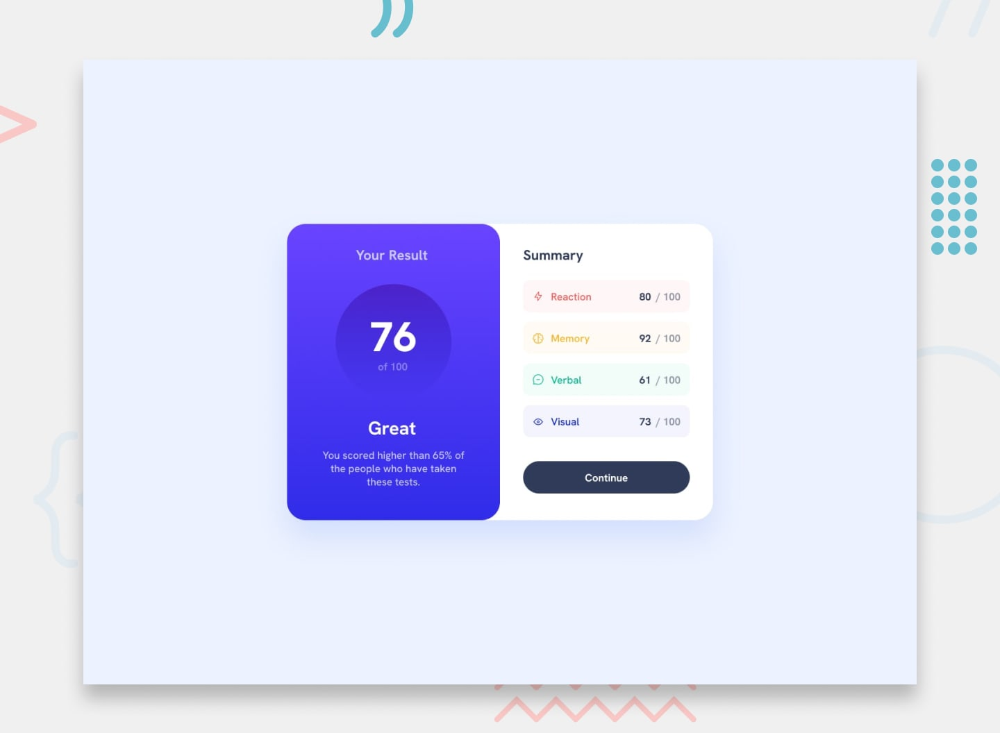

# Frontend Mentor - Results summary component

Card Layout UI

✨ Overview

This project is a responsive, gradient-themed card component layout, perfect for presenting data or summaries in a structured, visually engaging way. The design uses a flexible layout that adjusts beautifully between desktop and mobile views, with a focus on clarity, spacing, and smooth visual hierarchy.

📐 Layout Features

Two-column layout on larger screens (info + details)
Stacked layout on mobile screens
Gradient backgrounds for visual appeal
Responsive design using media queries
Themed card items with unique background and text colors
Accessible and clean typography

🛠️ Built With

CSS Flexbox – For creating flexible layouts
CSS Variables – For reusable and consistent colors and spacing
Responsive Design – Adjusts gracefully on smaller screens
Linear Gradients – For colorful backgrounds
BEM Naming Convention – For clear and scalable CSS structure

🎨 What I Learned

How to apply linear gradients properly using the background property
Using CSS variables to manage theme colors and spacing values
Structuring layout with Flexbox and keeping it responsive
Creating reusable button styles with hover effects
Organizing CSS using the BEM methodology for maintainability

🔁 Continued Development

Add interactivity using JavaScript (e.g. dropdowns, filtering)
Enhance with transitions or animations for smoother UX
Improve accessibility with better focus states and ARIA labels
Convert to a reusable component in a design system or pattern library
Expand the card layout into a dashboard with multiple sections
